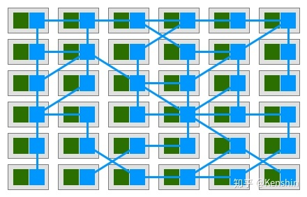
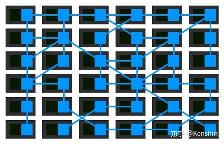

[toc]

# 1. Service Mesh的定义

Service Mesh 是微服务时代的 TCP/IP 协议

服务网格是一个专注于处理服务通信的基础设施层，负责在现代云原生应用组成的复杂服务拓扑中可靠地传递请求 

## 服务网格的特点：

1.  轻量级网络代理
2.  应用无感知 
3.  应用之间的流量由服务网格接管 
4.  服务之间的调用可能出现超时、重试、监控、追踪等工作可以由服务网格层面处理 

图中绿色表示应用，可以看做一个pod，蓝色表示网格中轻量级网络代理，代理之间互相通信，应用之间的通信由代理来完成

如果抛开应用不谈，每个服务之间的网络代理联合在一起类似网状结构，因此为服务网格，网格一般由数据面和控制面组成

这些网格之间也需要进行管理，所以也需要控制面和数据面，数据平面中会部署一个sidecar(边车)的请求代理，控制面会建立sidecar之间的交互，以及用户和sidecar之间的交互 

## 服务网格的优势

随着服务的数量增长， 每个服务都需要自己管理复杂的服务间通信，所以需要服务治理包含很多功能： 服务发现、负载均衡、故障转移、监控等功能 

