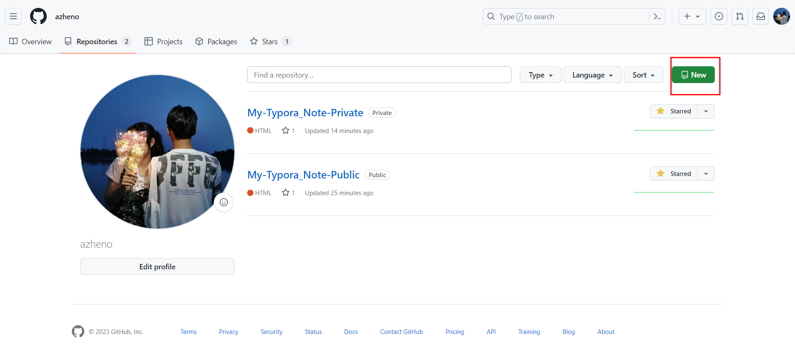
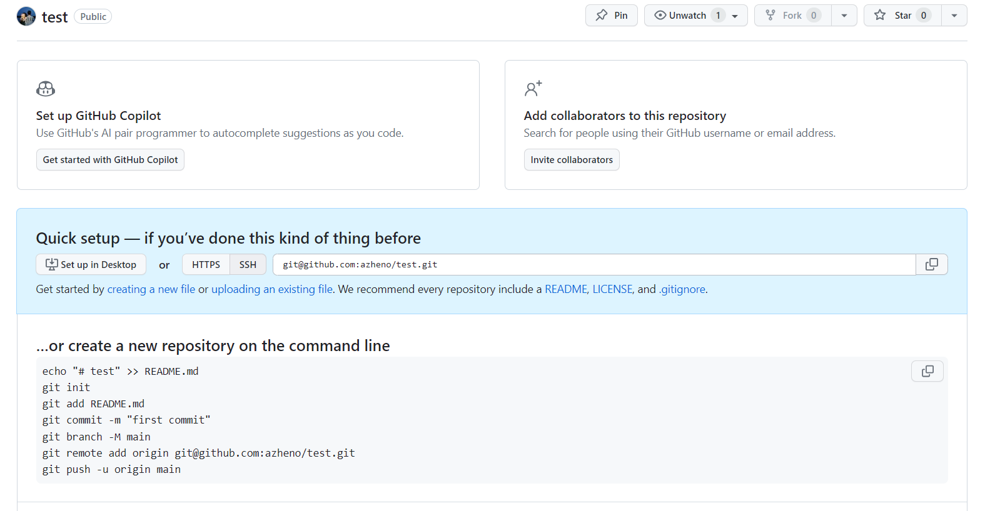
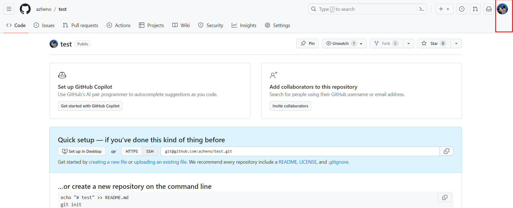
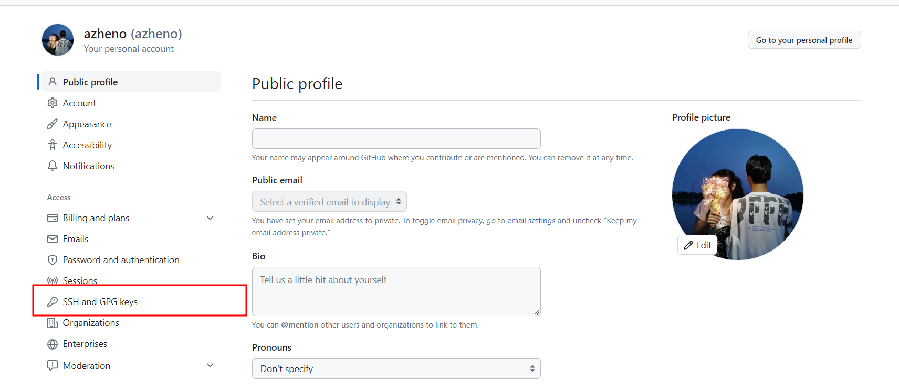
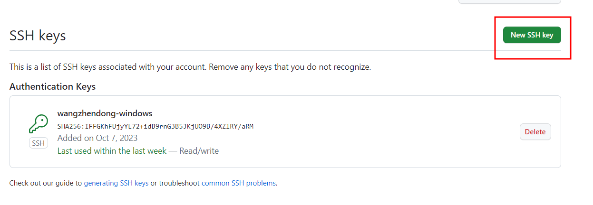
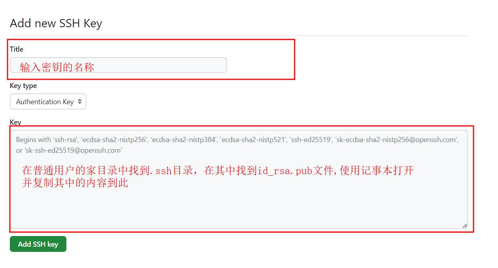

[toc]


# Git


## 对接Git仓库


### 1. 在github中创建一个repos


#### 点击头像


#### 选择your repositories 


#### 找到New，点击




#### 填写并选择对应信息，完成后点击创建


>   不要点击 Add a README file 的选项，后续可能因为结构不匹配而产生别的问题，如果需要README.md文件，可以在写项目的时候自己写上

#### 创建完成后得到如下图




### 2. 配置ssh密钥


#### 打开git bash 输入命令

```shell
ssh-keygen -t rsa -C "your github e-mail address: <xxxxx@xxxxx.com>" 
```


#### 点击头像 找到settings




#### 找到SSH and GPG keys




#### 点击New SSH key 创建新的密钥



#### 输入需要创建密钥的信息，点击创建



### 3. 上传项目


#### 在需要上传项目的目录中打开git bash，并准备上传


#### 初始化项目

```shell
git init  # 初始化需要上传的项目，初始化结束之后会生成一个.git目录
```

>   第一次上传需要填写用户名和邮箱 

```shell
git config --global user.email "xxxx@xxxx.com"  # 填写github的邮箱
git config --global user.name "xxxx" 	# 填写github的用户名
```


#### 将需要上传的项目添加进缓冲区

```shell
git add .  # .的含义是将当前目录中的全部内容都添加进入缓冲区 
		   # . 可以被替换为任意一个路径
```

>   **PS** : git的原理是先将项目添加进入缓冲区，然后通过分支比对来判断是否修改过，进而再次上传覆盖原先操作，以达到版本控制的效果，因此add的操作并不是上传到了github仓库中，只是上传到了缓冲区中而已 


#### 为上传的项目给一个上传说明

```shell
git commit -m "xxxxx" # 其中xxxx为说明信息，也就是在github中项目名后面的解释内容
```


#### 关联github仓库

```shell
git remote add xxxx xxx@xxxx.git  # 其中第一个需要填写的内容是仓库的别名，第二个填写内容跟是仓库的git地址或者是ssh地址
```

>   注意：第一次关联的时候推荐使用ssh地址，以免出现问题


#### 上传项目

```shell
git push -u xxxx master  # 其中需要填写的内容是你的仓库别名，master为默认分支的名称，第一次上传的时候需要添加-u选项，以免出现意外
```


