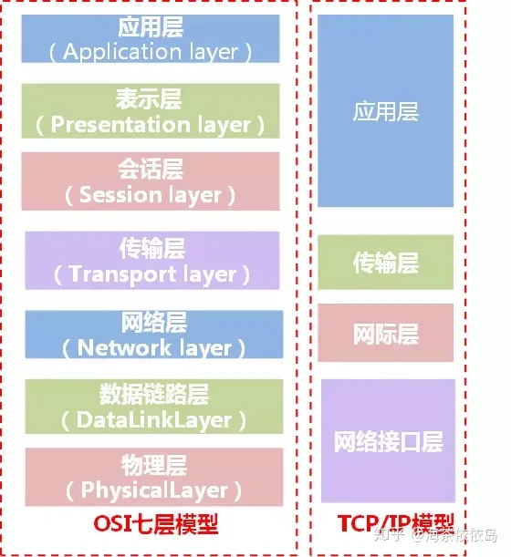
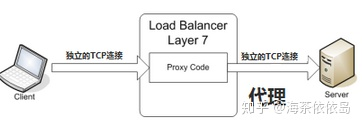
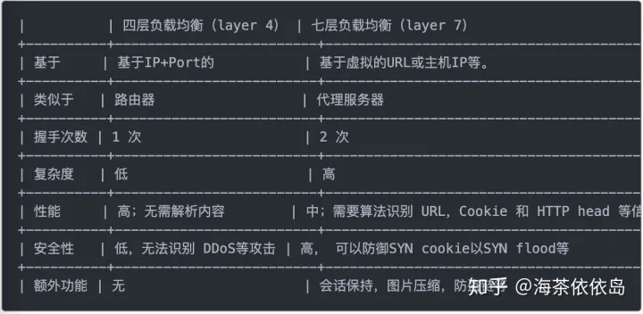

# 负载均衡总结（四层负载与七层负载的区别）

## 1. 什么是负载均衡

负载均衡建立在现有网络结构之上，它提供了一种廉价有效透明的方法扩展网络设备和服务器的带宽、增加吞吐量、加强网络数据处理能力、提高网络的灵活性和可用性。

## 2. 负载均衡分类

负载均衡根据所采用的设备对象（**软/硬件负载均衡**），应用的 OSI 网络层次（**网络层次上的负载均衡**），及应用的地理结构（**本地/全局负载均衡**）等来分类。本文着重介绍的是**根据应用的 OSI 网络层次来分类**的两个负载均衡类型。

我们先来看一张图，相信很多同学对这张图都不陌生，这是一张网络模型图，包含了 OSI 模型及 TCP/IP 模型，两个模型虽然有一点点区别，但主要的目的是一样的，模型图描述了通信是怎么进行的。它解决了实现有效通信所需要的所有过程，并将这些过程划分为逻辑上的层。层可以简单地理解成数据通信需要的步骤。

OSI_TCP/IP

根据负载均衡所作用在 OSI 模型的位置不同，负载均衡可以大概分为以下几类：

**二层负载均衡（mac）**

根据 OSI 模型分的二层负载，一般是用虚拟 MAC 地址方式，外部对虚拟 MAC 地址请求，负载均衡接收后分配后端实际的 MAC 地址响应。

**三层负载均衡（ip）**

***一般采用虚拟 IP 地址方式，外部对虚拟的 IP 地址请求，负载均衡接收后分配后端实际的 IP 地址响应。\***

**四层负载均衡（tcp）**

***在三层负载均衡的基础上，用 ip+port 接收请求，再转发到对应的机器。\***

**七层负载均衡（http）**

***根据虚拟的 url 或 IP，主机名接收请求，再转向相应的处理服务器。\***

**在实际应用中，比较常见的就是四层负载及七层负载**。这里也重点说下这两种负载。

**3. 四层负载均衡（基于IP+端口的负载均衡）**

***所谓四层负载均衡，也就是主要通过报文中的目标地址和端口，再加上负载均衡设备设置的服务器选择方式，决定最终选择的内部服务器。\***

layer4

1.  *在三层负载均衡的基础上，通过发布三层的 IP 地址（VIP），然后加四层的端口号，来决定哪些流量需要做负载均衡，对需要处理的流量进行 NAT 处理，转发至后台服务器，并记录下这个 TCP 或者 UDP 的流量是由哪台服务器处理的，后续这个连接的所有流量都同样转发到同一台服务器处理。*（注：NAT：Network Address Translation）
2.  以常见的 TCP 为例，**负载均衡设备在接收到第一个来自客户端的 SYN 请求时，即通过上述方式选择一个最佳的服务器，并对报文中目标 IP 地址进行修改（改为后端服务器 IP），直接转发给该服务器。\*TCP 的连接建立，即三次握手是客户端和服务器直接建立的，负载均衡设备只是起到一个类似路由器的转发动作。\***在某些部署情况下，为保证服务器回包可以正确返回给负载均衡设备，在转发报文的同时可能还会对报文原来的源地址进行修改。
3.  对应的负载均衡器称为四层交换机（L4 switch），主要分析 IP 层及 TCP/UDP 层，实现四层负载均衡。此种负载均衡器不理解应用协议（如 HTTP/FTP/MySQL 等等）。要处理的流量进行 NAT 处理，转发至后台服务器，并记录下这个 TCP 或者 UDP 的流量是由哪台服务器处理的，后续这个连接的所有流量都同样转发到同一台服务器处理。
4.  实现四层负载均衡的软件有：

-   F5：硬件负载均衡器，功能很好，但是成本很高
-   lvs：重量级的四层负载软件
-   nginx：轻量级的四层负载软件，带缓存功能，正则表达式较灵活
-   haproxy：模拟四层转发，较灵活

## 4. 七层的负载均衡（基于虚拟的 URL 或主机 IP 的负载均衡)

**所谓七层负载均衡，也称为“内容交换”，也就是主要通过报文中的真正有意义的应用层内容，再加上负载均衡设备设置的服务器选择方式，决定最终选择的内部服务器。**

layer7

1.  ***在四层负载均衡的基础上（没有四层是绝对不可能有七层的）\***，再考虑应用层的特征，比如同一个 Web 服务器的负载均衡，除了根据 VIP 加 80 端口辨别是否需要处理的流量，还可根据七层的 URL、浏览器类别、语言来决定是否要进行负载均衡。举个例子，如果你的 Web 服务器分成两组，一组是中文语言的，一组是英文语言的，那么七层负载均衡就可以当用户来访问你的域名时，自动辨别用户语言，然后选择对应的语言服务器组进行负载均衡处理。
2.  以常见的 TCP 为例，负载均衡设备如果要根据真正的应用层内容再选择服务器，只能先代理最终的服务器和客户端建立连接（三次握手）后，才可能接受到客户端发送的真正应用层内容的报文，然后再根据该报文中的特定字段，再加上负载均衡设备设置的服务器选择方式，决定最终选择的内部服务器。***负载均衡设备在这种情况下，更类似于一个代理服务器。负载均衡和前端的客户端以及后端的服务器会分别建立 TCP 连接。所以从这个技术原理上来看，七层负载均衡明显的对负载均衡设备的要求更高，处理七层的能力也必然会低于四层模式的部署方式。\***
3.  对应的负载均衡器称为七层交换机（L7 switch），除了支持四层负载均衡以外，还有分析应用层的信息，如 HTTP 协议 URI 或 Cookie 信息，实现七层负载均衡。此种负载均衡器能理解应用协议。
4.  实现七层负载均衡的软件有：

-   haproxy：天生负载均衡技能，全面支持七层代理，会话保持，标记，路径转移
-   nginx：只在 http 协议和 mail 协议上功能比较好，性能与 haproxy 差不多
-   apache：功能较差
-   Mysql proxy：功能尚可

## 5. 两者之间的区别

举个例子形象的说明：四层负载均衡就像银行的自助排号机，每一个达到银行的客户根据排号机的顺序，选择对应的窗口接受服务；而七层负载均衡像银行大堂经理，先确认客户需要办理的业务，再安排排号。这样办理理财、存取款等业务的客户，会根据银行内部资源得到统一协调处理，加快客户业务办理流程。

总结：从上面的对比看来四层负载与七层负载**最大的区别就是效率与功能的区别**。四层负载架构设计比较简单，无需解析具体的消息内容，在网络吞吐量及处理能力上会相对比较高，而七层负载均衡的优势则体现在功能多，控制灵活强大。在具体业务架构设计时，使用七层负载或者四层负载还得根据具体的情况综合考虑。

