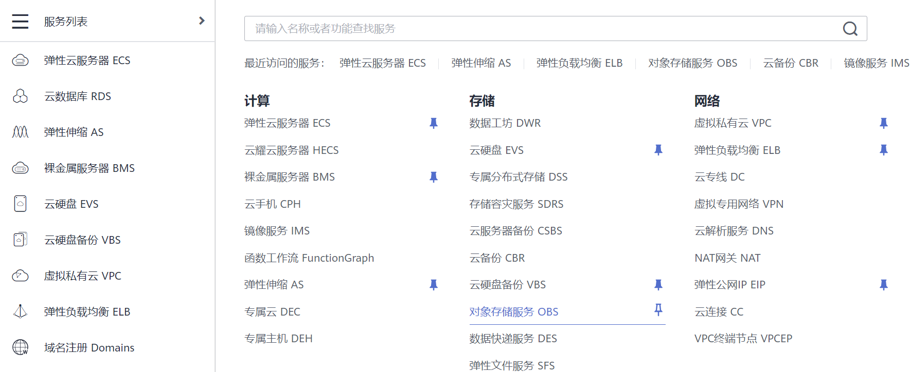
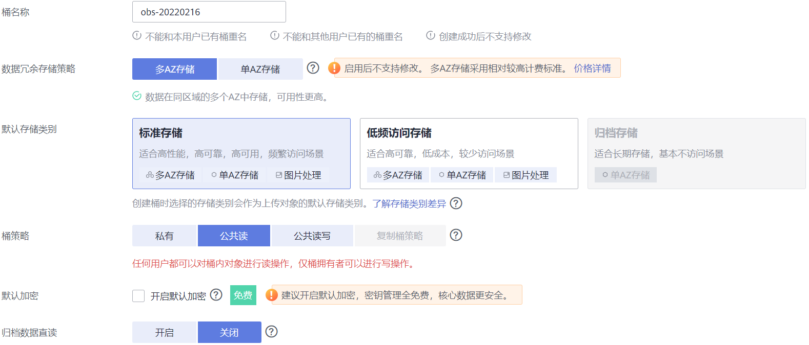
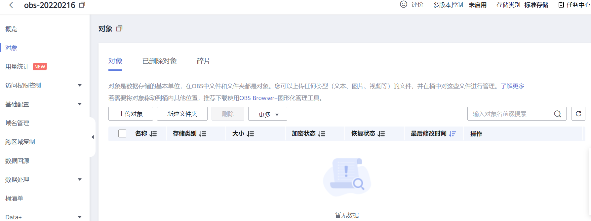
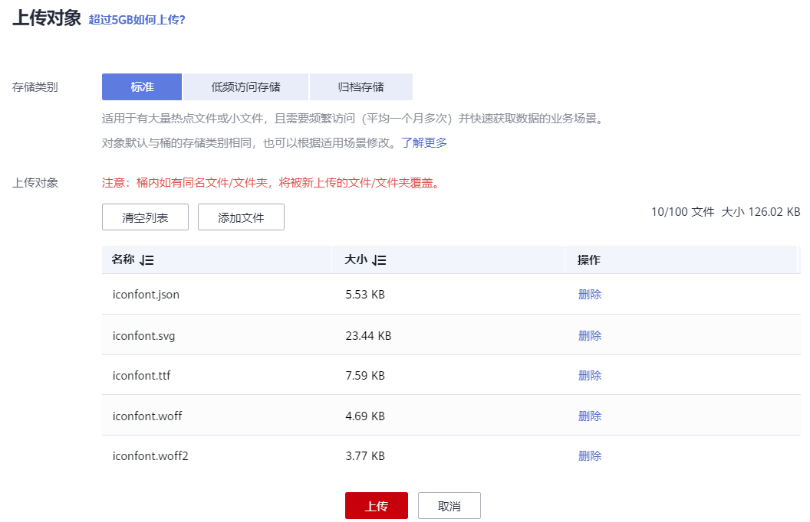
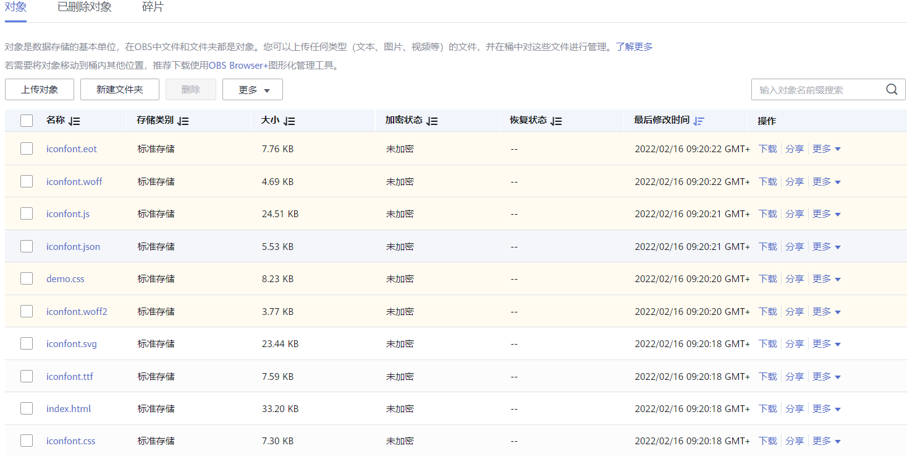
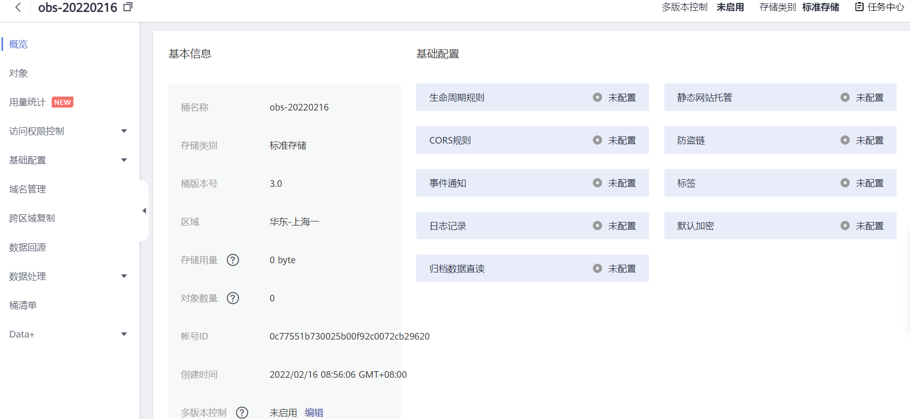
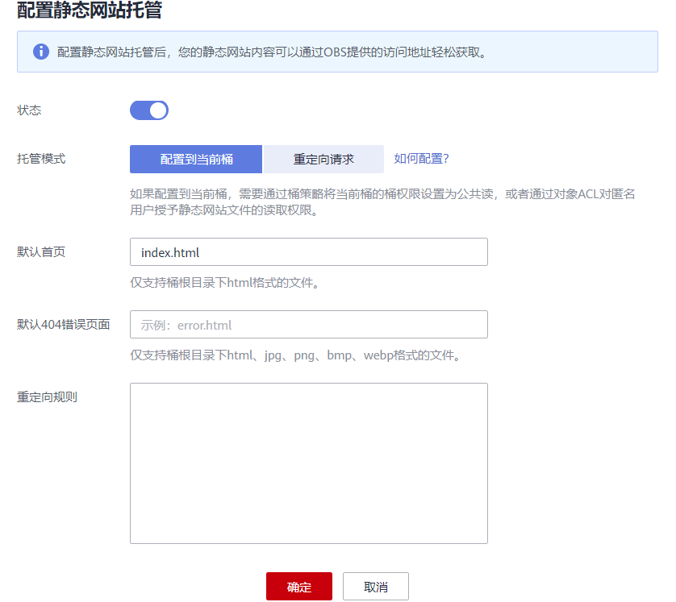

文本：案例准备

#### 基础准备


准备一个华为云公有云平台账号，并充值部分金额。并在华为云公有云中购买一个云服务器。

文本：案例实施

#### [点击播放小视频](https://fdfs.douxuedu.com/group1/M00/00/4B/wKggBmIq8BeAUlQaCIJ3yIzzHKE618.mp4) 

#### 1. 购买存储桶

##### （1）对象存储服务OBS

在华为云左上角服务列表，找到“存储>对象存储服务OBS”，进入OBS控制台页面，如图46所示。



图46 对象存储服务OBS

##### （2）创建存储桶

点击页面右上角“创建桶”按钮，配置桶名称为“obs-20220216”，数据冗余存储策略配置为“多AZ存储”，默认存储类别为“标准存储”，桶策略为“共共读”，其他选项均为默认，配置完成后点击右下角“立即创建”，如图47所示。



图47配置桶参数

创建完成后可在桶列表中查看到创建后的桶实例，如图48所示。


图48 桶列表

#### 2. 上传文件至存储桶

##### （1）对象

点击创建后的桶名称，在左侧的功能栏内选择“对象”按钮，如图49所示。



图49对象

##### （2）上传对象

在当前页面中点击“上传对象”按钮，进入后配置存储类别为“标准”，并将提供的文件上传至桶内，如图50所示。



图50 上传对象

##### （3）查看对象文件

上传完成后，可以查看到对象内的文件列表，如图51所示。



图51对象文件列表

#### 3. 静态网站托管

##### （1）配置静态网站托管

点击创建后的桶名称，进入桶的详细功能页面，如图52所示。



图52 桶信息

##### （2）配置静态网站托管参数

在桶详细信息页面，点击“静态网站托管”按钮，进入到网站托管配置页面，配置托管模式为“配置到当前桶”，默认首页为“index.html”，配置完成后点击“确定”，如图53所示。



图53 配置参数

##### （3）查看访问地址

静态网站参数配置完成后，我们可以看到会生成一个访问地址。通过这个访问地址我们就可以看到网站的页面。如图54所示。


图54 访问地址

**注意：基于安全合规要求，华为云对象存储服务OBS****禁止通过OBS****的默认域名（**[**桶访问域名或静态网站访问域名**](https://support.huaweicloud.com/productdesc-obs/obs_03_0152.html)**）使用静态网站托管功能，即使用上述域名从浏览器访问网页类型文件时，不会显示对象内容，而是以附件形式下载。**

我们可以通过一台主机，配置DNS后，使用curl命令去访问网页内容，命令如下：

```html
# curl https://obs-20220216.obs-website.cn-east-3.myhuaweicloud.com  
......
</ul>
      <div class="article markdown">
      <h2 id="font-class-">font-class 引用</h2>
      <hr>

      <p>font-class 是 Unicode 使用方式的一种变种，主要是解决 Unicode 书写不直观，语意不明确的问题。</p>
      <p>与 Unicode 使用方式相比，具有如下特点：</p>
      <ul>
        <li>兼容性良好，支持 IE8+，及所有现代浏览器。</li>
        <li>相比于 Unicode 语意明确，书写更直观。可以很容易分辨这个 icon 是什么。</li>
        <li>因为使用 class 来定义图标，所以当要替换图标时，只需要修改 class 里面的 Unicode 引用。</li>
        <li>不过因为本质上还是使用的字体，所以多色图标还是不支持的。</li>
      </ul>
      <p>使用步骤如下：</p>
      <h3 id="-fontclass-">第一步：引入项目下面生成的 fontclass 代码：</h3>
<pre><code class="language-html">&lt;link rel="stylesheet" href="./iconfont.css"&gt;
</code></pre>
      <h3 id="-">第二步：挑选相应图标并获取类名，应用于页面：</h3>
<pre><code class="language-html">&lt;span class="iconfont icon-xxx"&gt;&lt;/span&gt;
</code></pre>
      <blockquote>
        <p>"
          iconfont" 是你项目下的 font-family。可以通过编辑项目查看，默认是 "iconfont"。</p>
      </blockquote>
    </div>
    </div>
    <div class="content symbol">
        <ul class="icon_lists dib-box">

          <li class="dib">
              <svg class="icon svg-icon" aria-hidden="true">
                <use xlink:href="#icon-LC_icon_edit_line_1"></use>
              </svg>
              <div class="name">LC_icon_edit_line_1</div>
              <div class="code-name">#icon-LC_icon_edit_line_1</div>
          </li>

          <li class="dib">
              <svg class="icon svg-icon" aria-hidden="true">
                <use xlink:href="#icon-edit1"></use>
              </svg>
              <div class="name">edit</div>
              <div class="code-name">#icon-edit1</div>
          </li>

          <li class="dib">
              <svg class="icon svg-icon" aria-hidden="true">
                <use xlink:href="#icon-edit-"></use>
              </svg>
              <div class="name">edit-2</div>
              <div class="code-name">#icon-edit-</div>
          </li>
......
```

