文本：案例实施

#### [点击播放小视频](https://fdfs.douxuedu.com/group1/M00/00/4B/wKggBmIq8jWAeXG1D5Pq2RsO9ag302.mp4) 

#### 1. 申请公有云K8S集群

（1）登录华为云

登录华为云网站，进入“控制台”，选择“服务列表”-“容器”-“云容器引擎”服务。进入服务首页后选择购买“云容器引擎CCE”服务。如图1所示。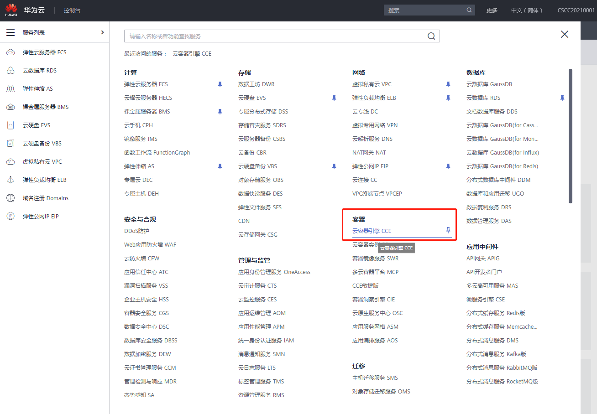

图1 云容器引擎CCE

在跳转页面单击CCE集群下的”创建“按钮。

（2）购买CCE

购买“云容器引擎CCE”服务，选择按需计费，集群名称为k8s-chinaskill，集群规格为单控制节点的cce.s1.small，集群版本为v1.21，如图2所示。

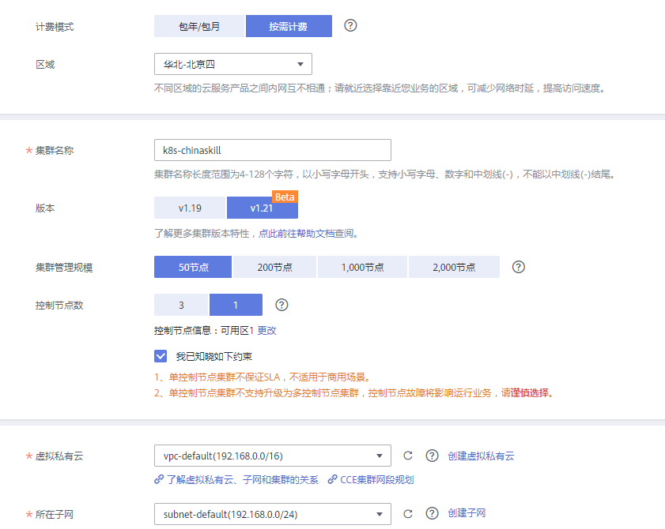

图2 购买集群参数


虚拟机节点名称为k8s-chinaskill-controller，节点规格选择s6.xlarge.2 4核 | 8GB，操作系统选择CentOS 7.6，如图3所示。下滑页面，密码设为Abc@1234，其他默认，单击“下一步：配置确认”按钮。然后选择默认插件（必装系统资源插件），确认配置，勾选”我已知晓上述限制“，单击”提交“按钮，完成服务购买。

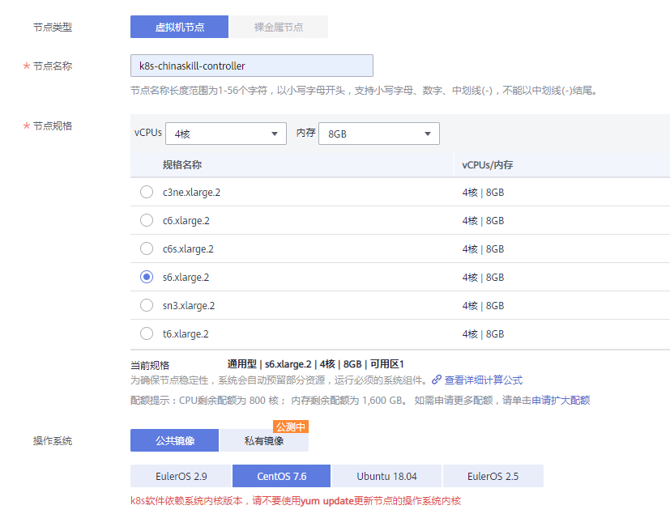

图3 购买集群控制节点参数

（3）集群控制节点绑定外网

为CCE容器节点虚拟机绑定弹性公网。选择“服务列表”-“计算”-“弹性云服务器ECS”服务，找到上一步创建的k8s-chinaskill-controller云服务器，选择更多，点击“网络设置==》绑定弹性公网IP”。如果有空闲的弹性公网IP，直接选择并绑定；如果没有，就按照弹窗提示购买新的弹性公网IP，之后重新进入弹性云服务器ECS”服务首页，为该云主机绑定弹性公网IP。如图4、图5、图6所示。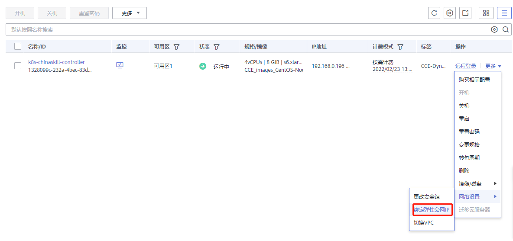

图4 绑定弹性公网1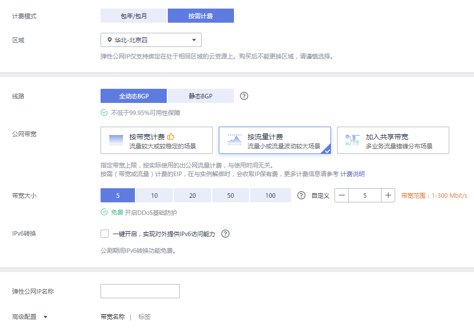

图5 购买弹性公网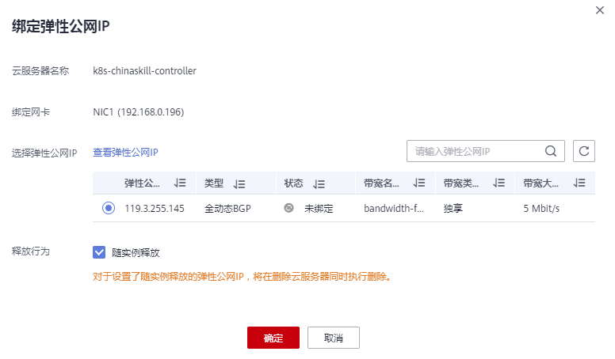

图6 绑定弹性公网2

复制云服务器的弹性公网IP地址119.3.255.145，可以使用CRT连接工具连接到k8s-chinaskill-controller节点，用户名为root，密码为购买服务时配置的密码。（如果连接失败，可以检查一下该云服务器的安全组规则，并修改为开放所有端口。）

（4）部署kubectl工具

选择“服务列表”-“计算”-“云容器引擎CCE”服务，点击菜单栏中的“资源管理”-“集群管理”，可以对购买的CCE集群服务进行管理；这里我们点击k8s-chinaskill集群命令行工具中的kubectl按钮。如图7所示。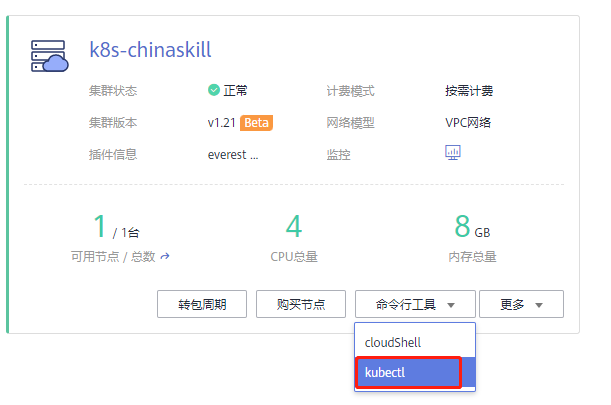

图7 kubectl

在新打开的页面中可以看到集群部署kubectl工具的步骤。如图8所示。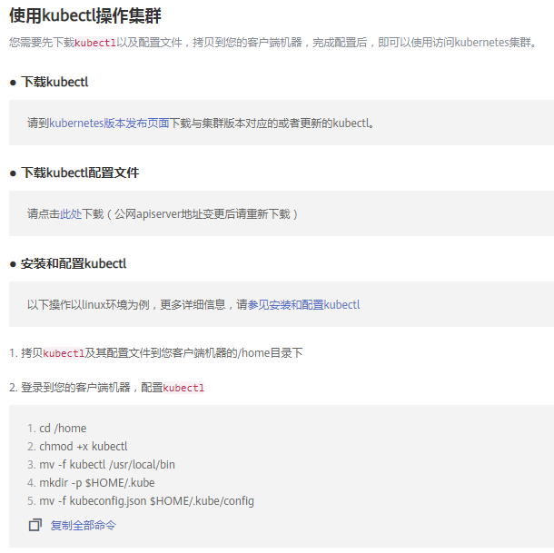

图8 部署kubectl工具

点击图8中的“此处”连接，将kubectl的配置文件kubeconfig.json下载下来。

使用CRT等SSH连接工具，通过上面绑定的弹性公网IP地址访问CCE集群的控制节点，将刚刚下载下来的配置文件kubeconfig.json上传到该节点中，并执行 mkdir -p $HOME/.kube 与 mv -f kubeconfig.json $HOME/.kube/config 这两个步骤，就完成kubectl工具的部署了。

kubectl工具部署完成后，执行kubectl cluster-info命令查看集群信息。

```shell
[root@k8s-chinaskill-controller ~]# mkdir -p $HOME/.kube
[root@k8s-chinaskill-controller ~]# mv -f kubeconfig.json $HOME/.kube/config
[root@k8s-chinaskill-controller ~]# kubectl cluster-info
Kubernetes control plane is running at https://192.168.0.178:5443
CoreDNS is running at https://192.168.0.178:5443/api/v1/namespaces/kube-system/services/coredns:dns/proxy

To further debug and diagnose cluster problems, use 'kubectl cluster-info dump'.
```

#### 2. 安装prometheus插件

（1）安装插件

进入“云容器引擎”服务，点击“插件管理”，在插件市场中找到prometheus监控插件，点击“安装插件”按钮。如图9所示。

图9 安装插件

选择k8s-chinaskill集群，点击下一步，全部默认规格配置，点击安装。如图10所示。

图10 选择k8s-chinaskill集群

安装完成后，点击“查看插件详情”，在“插件实例详情”中，等待prometheus监控插件所有资源全部显示运行中就可以了，如图11所示。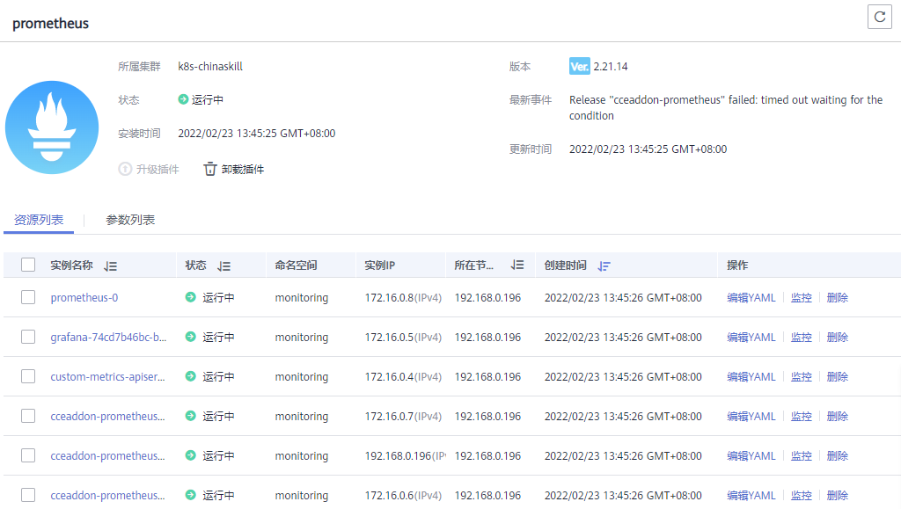

图11 prometheus插件运行

（2）新建prometheus的公网LoadBalancer类型service。

在“云容器引擎”服务中，进入“资源管理”下的“网络管理”，点击“添加Service”按钮，选择“负载均衡”服务。如图12所示。

图12 使用负载均衡访问服务

设置prometheus-lbl的service配置，访问类型为“负载均衡”，service名称为prometheus-lbl（不能重复使用相同的service名字）；选择k8s-chinaskill集群，选择monitoring命名空间，关联prometheus工作负载；配置容器端口为9090，访问端口为9090；其他全部选择默认选项。如图13、图14、图15所示。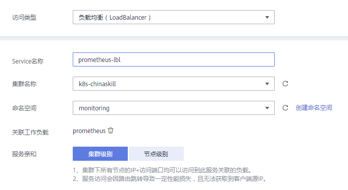

图13 prometheus-lbl的service配置1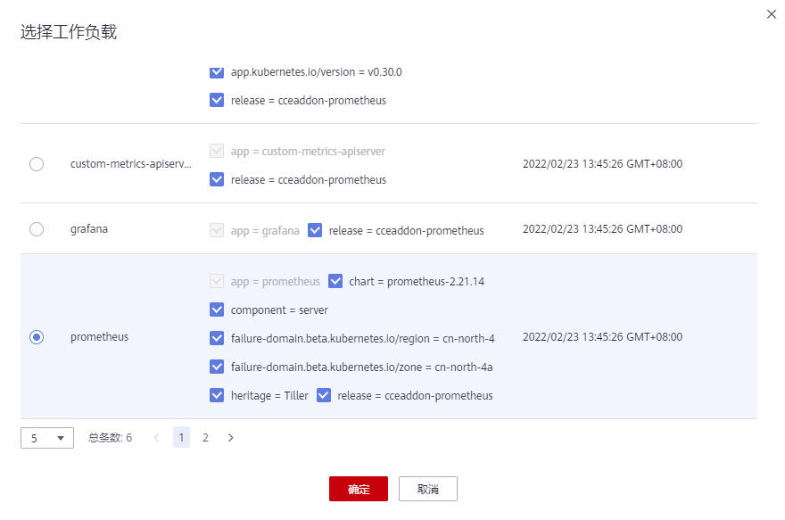

图14 prometheus-lbl的service配置2

图15 prometheus-lbl的service配置3

购买的service服务创建完成后，可以在网络管理中看到创建的prometheus-lbl服务。如图16所示。

图16 prometheus-lbl服务

（3）新建grafana的公网LoadBalancer类型service

在“云容器引擎”服务中，进入“资源管理”下的“网络管理”，点击“添加Service”按钮，选择“负载均衡”服务。

设置grafana-lbl的service配置，访问类型为“负载均衡”，service名称为grafana-lbl（不能重复使用相同的service名字）；选择k8s-chinaskill集群，选择monitoring命名空间，关联grafana工作负载；负载均衡设置选择上一步中已经创建的负载均衡服务“cce-lb-*”；配置容器端口为3000，访问端口为3000；其他全部选择默认选项。如图17、图18、图19、图20所示。

图17 grafana-lbl的service配置1

图18 grafana-lbl的service配置2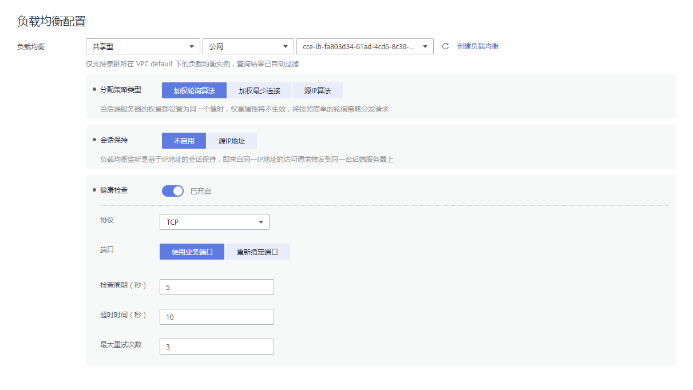

图19 grafana-lbl的service配置3

图20 grafana-lbl的service配置4

购买的service服务创建完成后，可以在网络管理中看到创建的grafana-lbl服务。如图21所示。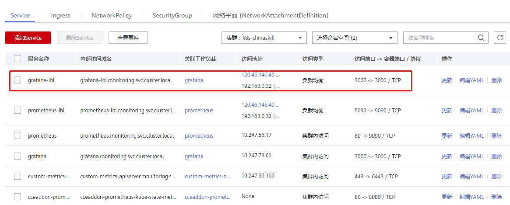

图21 grafana-lbl服务

（4）访问监控服务

通过图16和图21中两个lbl服务的外网访问路径120.46.146.49:9090、120.46.146.49:3000分别访问prometheus监控服务和grafana数据图表服务页面。如图22、图23所示。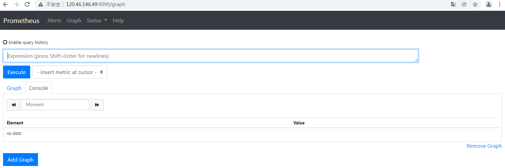

图22  prometheus监控服务首页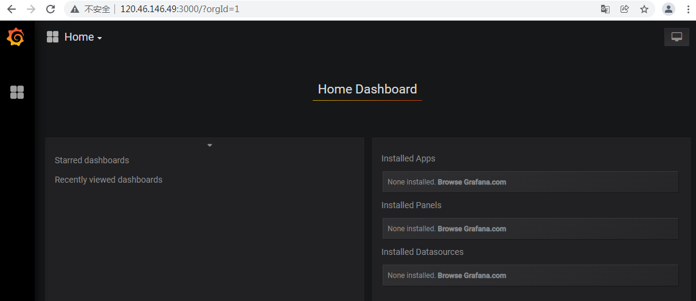

图23 grafana数据图表服务首页 

（5）查看k8s-chinaskill集群监控状态

由于是使用CCE集群的插件模式安装prometheus服务，所以prometheus监控服务已经自动部署了对宿主集群k8s-chinaskill的监控。

进入prometheus监控服务首页，查看Status ==》targets服务，可以看到对集群k8s-chinaskill的监控端口。如图24所示。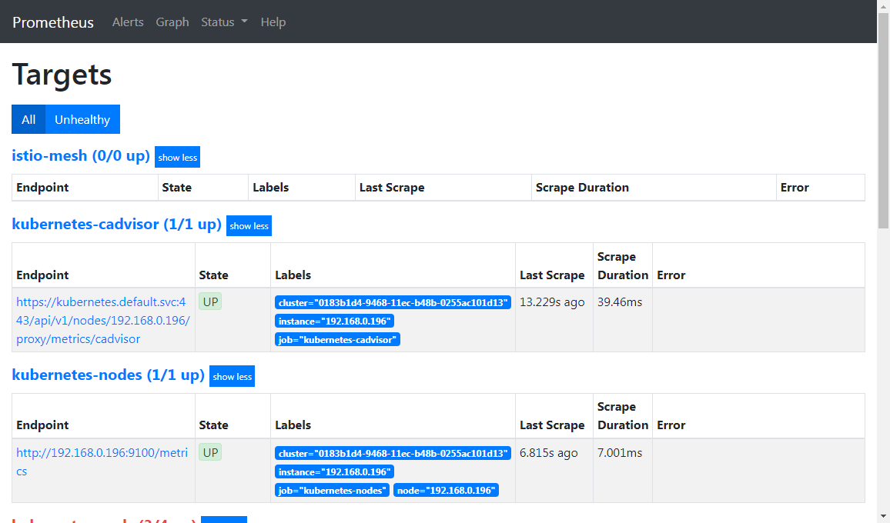

图24 targets服务

进入grafana服务首页，点击右上角的Home按钮，选择1-kubernetes-deployment-statefulset-daemonset-metrics的dashboard数据图表，可以看到对集群k8s-chinaskill的数据图表解析。如图25所示。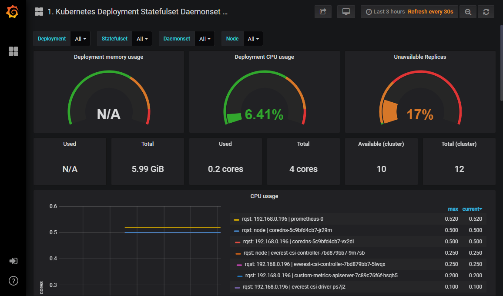

图25 1-kubernetes-deployment-statefulset-daemonset-metrics

#### 3. 添加对CCE集群中Nginx 容器服务监控

（1）创建可监控的Nginx 容器

CRT连接到k8s-chinaskill集群的控制节点，并使用kubectl工具部署Nginx服务，并添加prometheus的监控数据采集接口。

```shell
[root@k8s-chinaskill-controller ~]# docker pull nginx:1.21.5-alpine
[root@k8s-chinaskill-controller ~]# mkdir /root/nginx-exporter
[root@k8s-chinaskill-controller ~]# cd nginx-exporter/
[root@k8s-chinaskill-controller nginx-exporter]# cat nginx.conf
user nginx;
worker_processes auto;

error_log /var/log/nginx/error.log warn;
pid       /var/run/nginx.pid;

events {
  worker_connections  1024;
}

http {
  include       /etc/nginx/mime.types;
  default_type application/octet-stream;
  log_format main  '$remote_addr - $remote_user [$time_local] "$request" '
                     '$status $body_bytes_sent "$http_referer" '
                     '"$http_user_agent" "$http_x_forwarded_for"';

  access_log /var/log/nginx/access.log main;
  sendfile       on;
   #tcp_nopush     on;
  keepalive_timeout  65;
   #gzip on;
  include /etc/nginx/conf.d/*.conf;

  server {
    listen 8080;
    server_name localhost;
    location /stub_status {
        stub_status on;
        access_log off;
    }
  }
}

[root@k8s-chinaskill-controller nginx-exporter]# cat Dockerfile
FROM nginx:1.21.5-alpine
ADD nginx.conf /etc/nginx/nginx.conf
EXPOSE 80
CMD ["nginx", "-g", "daemon off;"]

[root@k8s-chinaskill-controller nginx-exporter]# docker build -t nginx:exporter .
[root@k8s-chinaskill-controller nginx-exporter]# cd
[root@k8s-chinaskill-controller ~]# docker pull nginx/nginx-prometheus-exporter:0.9.0
[root@k8s-chinaskill-controller ~]# cat nginx-exporter.yaml
kind: Deployment
apiVersion: apps/v1
metadata:
name: nginx-exporter
namespace: default
spec:
replicas: 1
selector:
  matchLabels:
    app: nginx-exporter
template:
  metadata:
    labels:
      app: nginx-exporter
    annotations:
      prometheus.io/scrape: "true"
      prometheus.io/port: "9113"
      prometheus.io/path: "/metrics"
      prometheus.io/scheme: "http"
  spec:
    containers:
       - name: container-0
        image: 'nginx:exporter'
        resources:
          limits:
            cpu: 250m
            memory: 512Mi
          requests:
            cpu: 250m
            memory: 512Mi
       - name: container-1
        image: 'nginx/nginx-prometheus-exporter:0.9.0'
        command:
           - nginx-prometheus-exporter
        args:
           - '-nginx.scrape-uri=http://127.0.0.1:8080/stub_status'
    imagePullSecrets:
       - name: default-secret

[root@k8s-chinaskill-controller ~]# kubectl apply -f nginx-exporter.yaml
deployment.apps/nginx-exporter created
[root@k8s-chinaskill-controller ~]# kubectl get pods
NAME                             READY   STATUS   RESTARTS   AGE
nginx-exporter-6ff78759bc-sscbs   2/2     Running   0         3s
```

（2）查看prometheus监控

由于是使用容器创建的Nginx服务，所以进入prometheus监控targets服务中，我们就可以在Kubenetes-pod中看到对Nginx的服务器监控。如图26所示。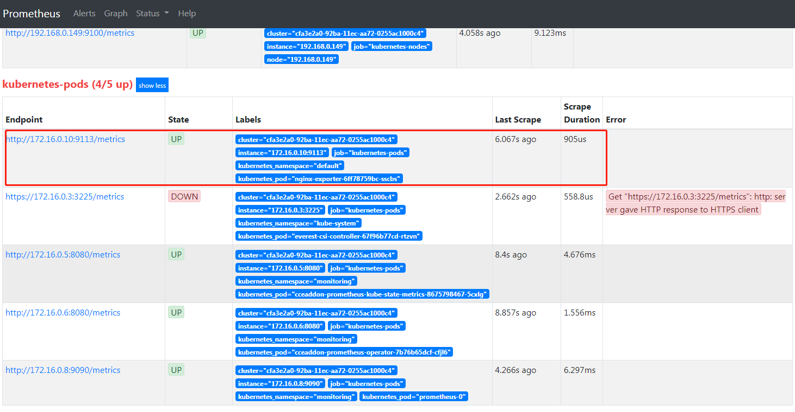

图26 Nginx服务监控