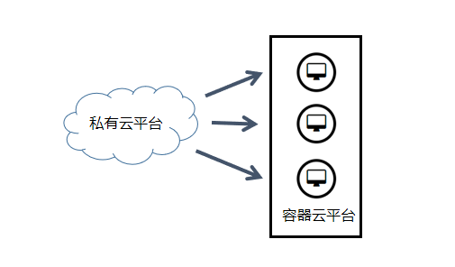
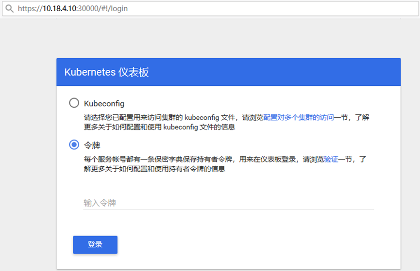
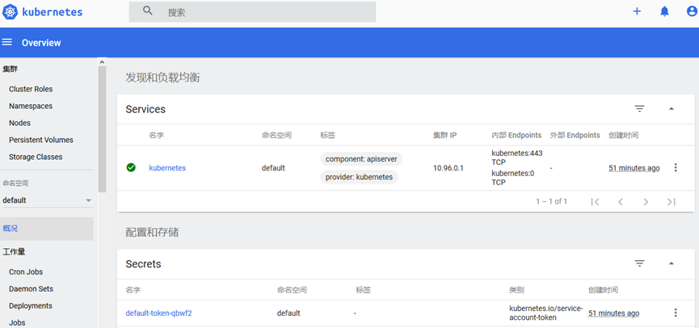

# B场次题目：容器的编排与运维



某企业计划使用k8s平台搭建微服务系统，现在先使用简单的微服务项目进行测试，请按照要求完成相应任务。

上表 IP地址规划

| 设备名称  | 主机名 | 接口 | IP地址                                | 说明 |
| --------- | ------ | ---- | ------------------------------------- | ---- |
| 云服务器1 | master | eth0 | 公网IP:****  私网IP:192.168.100.11/24 |      |
| 云服务器2 | node1  | eth0 | 公网IP:****  私网IP:192.168.100.12/24 |      |
| 云服务器3 | node2  | eth0 | 公网IP:****  私网IP:192.168.100.13/24 |      |
| 云服务器4 | harbor | eth0 | 公网IP:****  私网IP:192.168.100.14/24 |      |

**说明：**

1.   上表中的公网IP以自己云主机显示为准，每个人的公网IP不同。使用第三方软件远程连接云主机，使用公网IP连接。

2.   华为云中云主机名字已命好，直接使用对应名字的云主机即可。


 

## 任务一：容器云平台环境初始化（5 分）


### 1.容器云平台的初始化

master节点、node1节点和node2节点关闭swap，同时所有节点永久关闭selinux以及防火墙,并修改hosts映射。


-   [ ] 请将master节点hosts文件内容提交到答题框。【1分】


评分检测：192.168.100.11 master &&192.168.100.12 node1&&192.168.100.13 node2&&192.168.100.14 harbor


```shell
#完整答案：

#(1)修改主机名并配置映射

master节点：
[root@master ~]# hostnamectl set-hostname master
[root@master ~]# cat /etc/hosts
127.0.0.1   localhost localhost.localdomain localhost4 localhost4.localdomain4
::1         localhost localhost.localdomain localhost6 localhost6.localdomain6
192.168.100.11 master
192.168.100.12 node1
192.168.100.13 node2
192.168.100.14 harbor

node1节点：
[root@node1 ~]# hostnamectl set-hostname node1
[root@node1 ~]# cat /etc/hosts
127.0.0.1   localhost localhost.localdomain localhost4 localhost4.localdomain4
::1         localhost localhost.localdomain localhost6 localhost6.localdomain6
192.168.100.11 master
192.168.100.12 node1
192.168.100.13 node2
192.168.100.14 harbor

node2节点：
[root@node2 ~]# hostnamectl set-hostname node2
[root@node2 ~]# cat /etc/hosts
127.0.0.1   localhost localhost.localdomain localhost4 localhost4.localdomain4
::1         localhost localhost.localdomain localhost6 localhost6.localdomain6
192.168.100.11 master
192.168.100.12 node1
192.168.100.13 node2
192.168.100.14 harbor

harbor节点：
[root@harbor ~]# hostnamectl set-hostname harbor
[root@harbor ~]# cat /etc/hosts
127.0.0.1   localhost localhost.localdomain localhost4 localhost4.localdomain4
::1         localhost localhost.localdomain localhost6 localhost6.localdomain6
192.168.100.11 master
192.168.100.12 node1
192.168.100.13 node2
192.168.100.14 harbor

#(2)关闭SELinux和防火墙

## 所有节点关闭SELinux：
master节点: 
[root@master ~]# sed -i 's/SELINUX=enforcing/SELINUX=disabled/g' /etc/selinux/config
[root@master ~]# setenforce 0

node1节点: 
[root@node1 ~]# sed -i 's/SELINUX=enforcing/SELINUX=disabled/g' /etc/selinux/config
[root@node1 ~]# setenforce 0

node2节点: 
[root@node2 ~]# sed -i 's/SELINUX=enforcing/SELINUX=disabled/g' /etc/selinux/config
[root@node2 ~]# setenforce 0

harbor节点: 
[root@harbor ~]# sed -i 's/SELINUX=enforcing/SELINUX=disabled/g' /etc/selinux/config
[root@harbor ~]# setenforce 0

## 所有节点关闭防火墙：
master节点: 
[root@master ~]# systemctl stop firewalld.service
[root@master ~]# systemctl disable firewalld.service

node1节点: 
[root@node1 ~]# systemctl stop firewalld.service
[root@node1 ~]# systemctl disable firewalld.service

node2节点: 
[root@node2 ~]# systemctl stop firewalld.service
[root@node2 ~]# systemctl disable firewalld.service

harbor节点: 
[root@harbor ~]# systemctl stop firewalld.service
[root@harbor ~]# systemctl disable firewalld.service


#(3)关闭swap

master和node节点关闭swap： 
[root@master ~]# sed -i 's/.*swap.*/#&/' /etc/fstab
[root@master ~]# swapoff -a
[root@node1 ~]# sed -i 's/.*swap.*/#&/' /etc/fstab
[root@node1 ~]# swapoff -a
[root@node2 ~]# sed -i 's/.*swap.*/#&/' /etc/fstab
[root@node2 ~]# swapoff -a
```


  

### 2．Yum源数据的持久化挂载

将提供的CentOS-7-x86_64-DVD-1804.iso和bricsskills_cloud_paas.iso光盘镜像移动到master节点 /root目录下，然后在 /opt目录下使用命令创建 /centos目录和 /paas目录，并将镜像文件CentOS-7-x86_64-DVD-1804.iso永久挂载到/centos目录下，将镜像文件chinaskills_cloud_paas.iso永久挂载到 /paas目录下。


-   [ ] 请设置永久开机自动挂载，并将设置的永久开机自动挂载的文件内容提交到答题框。【1分】


评分检测：/root/Chinaskill_Cloud_PaaS.iso  /opt/paas   xfs   defaults    0 0&&/root/ CentOS-7-x86_64-DVD-1804.iso /opt/centos   xfs   defaults    0 0


```shell
# master节点：

[root@master ~]# mkdir /opt/centos /opt/paas
[root@master ~]# mount -o loop /root/Chinaskill_Cloud_PaaS.iso /opt/paas
[root@master ~]# mount -o loop /root/CentOS-7-x86_64-DVD-1804.iso /opt/centos
[root@master ~]# vi /etc/fstab
/root/Chinaskill_Cloud_PaaS.iso   /opt/paas     xfs     defaults        0 0
/root/ CentOS-7-x86_64-DVD-1804.iso  /opt/centos     xfs     defaults        0 0
```


### 3．Yum源的编写

为master节点设置本地yum源，yum源文件名为local.repo，安装ftp服务，将ftp仓库设置为 /opt/，为node1节点和node2节点配置ftp源，yum源文件名称为ftp.repo，其中ftp服务器地址为master节点,配置ftp源时不要写IP地址。


-   [ ] 请将node1节点的yum源文件内容提交到答题框。【1分】


评分检测：baseurl=ftp://master/kubernetes-repo


完整答案：

```shell
master节点：
[root@master ~]# mv /etc/yum.repos.d/CentOS-* /home
[root@master ~]# cat << EOF >/etc/yum.repos.d/centos.repo
[k8s]
name=k8s
baseurl=file:///opt/kubernetes-repo
gpgcheck=0
enabled=1
EOF

# master节点安装ftp服务器：
[root@master ~]# yum install -y vsftpd
[root@master ~]# vi /etc/vsftpd/vsftpd.conf 
anon_root=/opt
[root@master ~]# systemctl start vsftpd && systemctl enable vsftpd

node节点：
[root@node1 ~]# mv /etc/yum.repos.d/CentOS-* /home
[root@node1 ~]# cat << EOF >/etc/yum.repos.d/ftp.repo
[k8s]
name=k8s
baseurl=ftp://master/kubernetes-repo
gpgcheck=0
enabled=1
EOF
```


 

### 4．设置时间同步服务器

在master节点上部署chrony服务器，允许其他节点同步时间，启动服务并设置为开机启动；在其他节点上指定master节点为上游NTP服务器，重启服务并设为开机启动。


-   [ ] 请将master节点修改的行的内容提交到答题框。【1分】


评分检测：server 192.168.100.11 iburst&& allow 192.168.100.0/24


完整答案：

```shell
# master节点：
yum install -y chronyd
vi /etc/chrony.conf
server 192.168.100.11 iburst
allow  192.168.100.0/24
local stratum 10
systemctl start chronyd
systemctl enable chronyd
# node节点：
yum install -y chronyd
vi /etc/chrony.conf
server 192.168.100.11 iburst
systemctl start chronyd
systemctl enable chronyd
chronyc sources
```


 

### 5.设置免密登录

为四台服务器设置免密登录，保证服务器之间能够互相免密登录。


请将master节点免密登录的命令提交到答题框。【1分】


评分检测：ssh-keygen&& ssh-copy-id node1&& ssh-copy-id node2&& ssh-copy-id harbor


完整答案：

```shell
master节点：
ssh-keygen
ssh-copy-id node1
ssh-copy-id node2
ssh-copy-id harbor
   其它节点的命令和上面一样
```


 

## 任务二 k8s搭建任务（10分）


### 1．安装docker应用

在所有节点上安装dokcer-ce。安装完成后修改docker启动引擎为systemd并配置阿里云镜像加速地址，配置成功重启docker服务器。


请将daemon.json文件内容提交到答题框。【1分】


评分检测："registry-mirrors"

完整答案：

```shell
所有节点安装Docker-ce：
# yum install -y yum-utils device-mapper-persistent-data lvm2
# yum install -y docker-ce
启动Docker：
# systemctl start docker
# systemctl enable docker
在所有节点调整部分docker参数：
# tee /etc/docker/daemon.json <<-'EOF'
{
"registry-mirrors": ["https://5twf62k1.mirror.aliyuncs.com"], 
  "exec-opts": ["native.cgroupdriver=systemd"]
}
EOF
# systemctl restart docker
# docker version
```


### 2．安装docker-compose

在Harbor节点上使用 /opt/paas/docker-compose/v1.25.5-docker-compose-Linux-x86_6下的文件安装docker-compose。安装完成后执行docker-compose version命令。

请将docker-compose version命令返回结果提交到答题框。【0.5分】

评分检测：docker-compose version 1.25.5, build 8a1c60f6

完整答案：

```shell
# 在master节点安装docker-compose：

# cp -rfv /opt/paas/docker-compose/v1.25.5-docker-compose-Linux-x86_64 /usr/local/bin/docker-compose 
# chmod +x /usr/local/bin/docker-compose
# docker-compose version
docker-compose version 1.25.5, build 8a1c60f6
docker-py version: 4.1.0
CPython version: 3.7.5
OpenSSL version: OpenSSL 1.1.0l  10 Sep 2019
```


 

### 3．搭建horbor仓库

在Harbor节点使用/opt/paas/harbor/ harbor-offline-installer-v2.1.0.tgz离线安装包，安装harbor仓库，并修改各节点默认docker仓库为harbor仓库地址。


请将master节点daemon.json中的内容提交到答题框。【2分】


评分检测："insecure-registries" : ["harbor"]


完整答案：

```shell
Harbor节点部署Harbor
导入镜像：
# cd /opt/paas/images
# for img in `ls | grep goharbor`;do docker load -i $img;done
解压安装包：
# cd /opt/paas/harbor/
# tar -zxvf harbor-offline-installer-v2.1.0.tgz -C /usr/local/
# cd /usr/local/harbor/
修改Harbor配置信息：
# cp harbor.yml.tmpl harbor.yml
# vi harbor.yml
hostname: harbor  # 将域名修改为本机IP
harbor_admin_password: Harbor12345
#https:  # 禁用https
  # https port for harbor, default is 443
  # port: 443
  # The path of cert and key files for nginx
  # certificate: /your/certificate/path
  # private_key: /your/private/key/path
启动Harbor：
# ./prepare
# ./install.sh --with-clair
其他节点修改默认仓库地址：
# vi /etc/docker/daemon.json
{
  "insecure-registries" : ["harbor"],
"registry-mirrors": ["https://5twf62k1.mirror.aliyuncs.com"], 
  "exec-opts": ["native.cgroupdriver=systemd"]
}
# systemctl restart docker
各节点登录harbor
# docker login 192.168.100.14

```


 

### 4．上传docker镜像


在master节点使用命令将/opt/paas/images目录下所有镜像导入本地。然后使用/opt/paas/k8s_image_push.sh将所有镜像上传至docker仓库。


请将镜像导入本地的命令，提交到答题框。【1分】


评分检测：for img in $(ls);do docker load -i $img ; done


完整答案：

```shell
# cd /opt/paas/images/
# for img in $(ls);do docker load  -i $img ; done
# ./k8s_image_push.sh
输入镜像仓库地址(不加http/https): 192.168.100.14
输入镜像仓库用户名: admin
输入镜像仓库用户密码: Harbor12345
您设置的仓库地址为: 192.168.100.14,用户名: admin,密码: xxx
是否确认(Y/N): Y

```


 

### 5．安装kubeadm工具

在master及所有node节点安装Kubeadm工具并设置开机自动启动，安装完成后使用rpm命令配合grep查看Kubeadm工具是否正确安装。


请将maser节点安装Kubeadm工具的命令提交到答题框。【0.5分】


评分检测：yum -y install kubeadm-1.18.1 kubectl-1.18.1 kubelet-1.18.1


完整答案：

```shell
master及node节点安装Kubeadm工具：
# yum -y install kubeadm-1.18.1 kubectl-1.18.1 kubelet-1.18.1
# systemctl enable kubelet && systemctl start kubelet

```


### 6．kubeadm安装master

使用kubeadm命令生成yaml文件，并修改yaml文件，设置kubernetes虚拟内部网段地址为10.244.0.0/16，通过该yaml文件初始化master节点，然后使用kube-flannel.yaml完成控制节点初始化设置，完成后使用命令查看集群状态和所有pod。


请将查看集群状态的命令及结果提交到答题框。【2分】


评分检测：kubectl get cs&& controller-manager   Healthy   ok

完整答案：


```shell
在master节点生成初始配置yaml文件：
# kubeadm config print init-defaults > kubeadm-config.yaml
修改yaml文件
# vi kubeadm-config.yaml 
localAPIEndpoint:
  advertiseAddress: 192.168.100.11	#修改为master主机IP地址
imageRepository: registry.aliyuncs.com/google_containers 	#修改为阿里云镜像仓库地址
kubernetesVersion: v1.18.1		#修改版本号为当前版本号
networking:
  dnsDomain: cluster.local
  serviceSubnet: 10.96.0.0/12
  podSubnet: 10.244.0.0/16		#添加此subnet项
根据yaml文件使用kubeadm命令初始化master节点
# kubeadm init --config kubeadm-config.yaml
[init] Using Kubernetes version: v1.18.1
[preflight] Running pre-flight checks
[preflight] Pulling images required for setting up a Kubernetes cluster
..................
[addons] Applied essential addon: CoreDNS
[addons] Applied essential addon: kube-proxy

Your Kubernetes control-plane has initialized successfully!

To start using your cluster, you need to run the following as a regular user:

  mkdir -p $HOME/.kube
  sudo cp -i /etc/kubernetes/admin.conf $HOME/.kube/config
  sudo chown $(id -u):$(id -g) $HOME/.kube/config

You should now deploy a pod network to the cluster.
Run "kubectl apply -f [podnetwork].yaml" with one of the options listed at:
  https://kubernetes.io/docs/concepts/cluster-administration/addons/

Then you can join any number of worker nodes by running the following on each as root:

kubeadm join 10.18.4.10:6443 --token cxtb79.mqg7drycn5s82hhc \
    --discovery-token-ca-cert-hash sha256:d7465b10f81ecb32ca30459efc1e0efe4f22bfbddc0c17d9b691f611082f415c
初始化完成后执行：
# mkdir -p $HOME/.kube
# sudo cp -i /etc/kubernetes/admin.conf $HOME/.kube/config
# sudo chown $(id -u):$(id -g) $HOME/.kube/config
查看集群状态：
# kubectl get cs
NAME              STATUS    MESSAGE             ERROR
scheduler            Healthy     ok
controller-manager     Healthy     ok
etcd-0               Healthy     {"health":"true"}
查看节点状态：
# kubectl get nodes
NAME     STATUS     ROLES    AGE     VERSION
master     NotReady     master     2m57s    v1.18.1
可以发现master处于notready状态，这是正常的，因为还没有网络插件，接下来安装网络后就变为正常了：
# kubectl apply -f yaml/kube-flannel.yaml 
podsecuritypolicy.policy/psp.flannel.unprivileged created
clusterrole.rbac.authorization.k8s.io/flannel created
clusterrolebinding.rbac.authorization.k8s.io/flannel created
serviceaccount/flannel created
configmap/kube-flannel-cfg created
daemonset.apps/kube-flannel-ds created
# kubectl get pods -A
NAMESPACE     NAME            READY    STATUS    RESTARTS   AGE
kube-system   coredns-7ff77c879f-7vj79       1/1     Running   0          14m
kube-system   coredns-7ff77c879f-nvclj        1/1     Running   0          14m
kube-system   etcd-master                   1/1     Running   0          14m
kube-system   kube-apiserver-master           1/1     Running   0          14m
kube-system   kube-controller-manager-master   1/1     Running   0          14m
kube-system   kube-flannel-ds-d5p4g           1/1     Running   0          11m
kube-system   kube-proxy-2gstw              1/1     Running   0          14m
kube-system   kube-scheduler-master           1/1     Running   0          14m
# kubectl get nodes
NAME     STATUS   ROLES    AGE   VERSION
master      Ready     master     17m    v1.18.1

```


 

### 7. 删除污点

使用命令删除master节点的污点，使得Pod也可以调度到master节点上，操作成功配合grep查看master节点的污点。

请将删除master节点的污点的命令提交到答题框。【1分】


评分检测：kubectl taint nodes master node-role.kubernetes.io/master=:NoSchedule


完整答案：

 ```shell
 # kubectl taint nodes master node-role.kubernetes.io/master=:NoSchedule- 
 # kubectl get nodes -o yaml master | grep -A10 spec
 ```


### 8．安装kubernetes网络插件

使用kube-flannel.yaml 安装kubernetes网络插件，安装完成后使用命令查看节点状态。

请将kubectl get nodes命令的返回结果提交到答题框。【0.5分】

评分检测：master   Ready   master   17m  v1.18.1

完整答案：

```shell
# kubectl apply -f  kube-flannel.yaml 
podsecuritypolicy.policy/psp.flannel.unprivileged created
clusterrole.rbac.authorization.k8s.io/flannel created
clusterrolebinding.rbac.authorization.k8s.io/flannel created
serviceaccount/flannel created
configmap/kube-flannel-cfg created
daemonset.apps/kube-flannel-ds created
# kubectl get pods -A
NAMESPACE     NAME            READY    STATUS    RESTARTS   AGE
kube-system   coredns-7ff77c879f-7vj79       1/1     Running   0          14m
kube-system   coredns-7ff77c879f-nvclj        1/1     Running   0          14m
kube-system   etcd-master                   1/1     Running   0          14m
kube-system   kube-apiserver-master           1/1     Running   0          14m
kube-system   kube-controller-manager-master   1/1     Running   0          14m
kube-system   kube-flannel-ds-d5p4g           1/1     Running   0          11m
kube-system   kube-proxy-2gstw              1/1     Running   0          14m
kube-system   kube-scheduler-master           1/1     Running   0          14m
# kubectl get nodes
NAME     STATUS   ROLES    AGE   VERSION
master      Ready     master     17m    v1.18.1
```


 

### 9．kubernetes 图形化界面的安装

使用recommended.yaml和dashboard-adminuser.yaml安装kubernetes dashboard界面，完成后查看首页。

请将查看Dashboard 关联Pod和Service状态的命令及返回结果提交到答题框。【1分】

评分检测：kubectl get pod,svc -n kubernetes-dashboard


完整答案：

#### 1. 创建证书

```shell
# mkdir dashboard-certs
# cd dashboard-certs/
# kubectl create namespace kubernetes-dashboard
# openssl genrsa -out dashboard.key 2048
Generating RSA private key, 2048 bit long modulus
......................................+++
...........................................................+++
e is 65537 (0x10001)
# openssl req -days 36000 -new -out dashboard.csr -key dashboard.key -subj '/CN=dashboard-cert'
# openssl x509 -req -in dashboard.csr -signkey dashboard.key -out dashboard.crt
Signature ok
subject=/CN=dashboard-cert
Getting Private key
# kubectl create secret generic kubernetes-dashboard-certs --from-file=dashboard.key --from-file=dashboard.crt -n kubernetes-dashboard
```

#### 2. 安装dashboard

```shell
# kubectl apply -f recommended.yaml 
namespace/kubernetes-dashboard created
serviceaccount/kubernetes-dashboard created
service/kubernetes-dashboard created
secret/kubernetes-dashboard-certs created
secret/kubernetes-dashboard-csrf created
secret/kubernetes-dashboard-key-holder created
configmap/kubernetes-dashboard-settings created
role.rbac.authorization.k8s.io/kubernetes-dashboard created
clusterrole.rbac.authorization.k8s.io/kubernetes-dashboard created
rolebinding.rbac.authorization.k8s.io/kubernetes-dashboard created
clusterrolebinding.rbac.authorization.k8s.io/kubernetes-dashboard created
deployment.apps/kubernetes-dashboard created
service/dashboard-metrics-scraper created
deployment.apps/dashboard-metrics-scraper created
```


#### 3. 查看Dashboard 关联Pod和Service的状态：

```shell
# kubectl get pod,svc -n kubernetes-dashboard
NAME                              READY   STATUS    RESTARTS   AGE
pod/dashboard-metrics-scraper-6b4884c9d5-f7qxd   1/1     Running   0          62s
pod/kubernetes-dashboard-5585794759-2c6xt       1/1     Running   0          62s

NAME          TYPE      CLUSTER-IP     EXTERNAL-IP   PORT(S)    AGE
service/dashboard-metrics-scraper  ClusterIP  10.105.228.249  <none>  8000/TCP  62s
service/kubernetes-dashboard   NodePort  10.98.134.7  <none>  443:30000/TCP   62s
```


#### 4.创建serviceaccount和clusterrolebinding

```shell
创建serviceaccount和clusterrolebinding
# kubectl apply -f dashboard-adminuser.yaml 
serviceaccount/dashboard-admin created
clusterrolebinding.rbac.authorization.k8s.io/dashboard-admin-bind-cluster-role created
在火狐浏览器访问dashboard（https://IP:30000），如图2.5-1所示：
```



>    图2.5-1 Dashboard认证界面


#### 5.获取Token,并进入dashboard：


```shell
# kubectl -n kubernetes-dashboard describe secret $(kubectl -n kubernetes-dashboard get secret | grep dashboard-admin | awk '{print $1}')
Name:         dashboard-admin-token-x9fnq
Namespace:    kubernetes-dashboard
Labels:       <none>
Annotations:  kubernetes.io/service-account.name: dashboard-admin
              kubernetes.io/service-account.uid: f780f22d-f620-4cdd-ad94-84bf593ca882

Type:  kubernetes.io/service-account-token

Data
====
ca.crt:     1025 bytes
namespace:  20 bytes
token:      eyJhbGciOiJSUzI1NiIsImtpZCI6IkRWNXNrYWV6dFo4bUJrRHVZcmwtcTVpNzdFMDZYZjFYNzRzQlRyYmlVOGsifQ.eyJpc3MiOiJrdWJlcm5ldGVzL3NlcnZpY2VhY2NvdW50Iiwia3ViZXJuZXRlcy5pby9zZXJ2aWNlYWNjb3VudC9uYW1lc3BhY2UiOiJrdWJlcm5ldGVzLWRhc2hib2FyZCIsImt1YmVybmV0ZXMuaW8vc2VydmljZWFjY291bnQvc2VjcmV0Lm5hbWUiOiJkYXNoYm9hcmQtYWRtaW4tdG9rZW4teDlmbnEiLCJrdWJlcm5ldGVzLmlvL3NlcnZpY2VhY2NvdW50L3NlcnZpY2UtYWNjb3VudC5uYW1lIjoiZGFzaGJvYXJkLWFkbWluIiwia3ViZXJuZXRlcy5pby9zZXJ2aWNlYWNjb3VudC9zZXJ2aWNlLWFjY291bnQudWlkIjoiZjc4MGYyMmQtZjYyMC00Y2RkLWFkOTQtODRiZjU5M2NhODgyIiwic3ViIjoic3lzdGVtOnNlcnZpY2VhY2NvdW50Omt1YmVybmV0ZXMtZGFzaGJvYXJkOmRhc2hib2FyZC1hZG1pbiJ9.h5BGk2yunmRcA8U60wIJh0kWpRLI1tZqS58BaDy137k1SYkvwG4rfG8MGnoDMAREWd9JIX43N4qpfbivIefeKIO_CZhYjv4blRefjAHo9c5ABChMc1lrZq9m_3Br_fr7GonsYulkaW6qYkCcQ0RK1TLlxntvLTi7gWMSes8w-y1ZumubL4YIrUh-y2OPoi2jJNevn4vygkgxtX5Y9LlxegVYJfeE_Sb9jV9ZL7e9kDqmBIYxm5PBJoPutjsTBmJf3IFrf6vUk6bBWtE6-nZgdf6FAGDd2W2-1YcidjITwgUvj68OfQ5tbB94EYlJhuoAGVajKxO14XaE9NH0_NZjqw

输入Token后进入Dashboard仪表盘界面，如图2.5-2所示：
```



>   如图2.5-2 Dashboard仪表盘界面

 

### 10．扩展计算节点

在所有node节点上使用kubeadm config命令生成yaml文件，并通过yaml文件将node节点加入kubernetes集群。完成后在master节点上查看所有节点状态。

请将查看节点信息的命令及返回结果提交到答题框。【0.5分】

评分检测：kubectl get nodes&& master   Ready   master   56m   v1.18.1&& master   Ready   master   56m   v1.18.1

完整答案：

  ```shell
  #（1）node节点加入集群
  在node节点执行以下命令生成yaml文件：
  [root@master flannel]# kubeadm config print join-defaults > kubeadm-config.yaml
  修改yaml文件如下内容：
  [root@master flannel]# vi  kubeadm-config.yaml 
  discovery:
    bootstrapToken:
      apiServerEndpoint: 192.168.100.11:6443
  执行如下命令加入集群
  [root@master flannel]# kubeadm join --config kubeadm-config.yaml
  
  #（2）拷贝网络插件
  加入之后，系统不会ready
  [root@master flannel]# kubectl  get node 
  NAME     STATUS     ROLES    AGE    VERSION
  master   Ready      master   123m   v1.18.1
  node1    NotReady   <none>   17m    v1.18.1
  node2    NotReady   <none>   16m    v1.18.1
  [root@node1 flannel]# mkdir /etc/cni/net.d/ -p 
  [root@node2 flannel]# mkdir /etc/cni/net.d/ -p 
  [root@master net.d]# scp /etc/cni/net.d/*  node1:/etc/cni/net.d/
  [root@master net.d]# scp /etc/cni/net.d/*  node2:/etc/cni/net.d/ 
  
  #（3）查看节点信息
  在master节点查看节点状态：
  [root@master flannel]# kubectl get nodes
  NAME    STATUS   ROLES    AGE   VERSION
  master     Ready     master     56m    v1.18.1
  node       Ready    <none>     60s    v1.18.1
  ```


## 任务三：K8s 运维任务[15 分]

为了方便公司企业内员工交流以及打造宽松化的办公环境，公司决定在企业内部搭建一个开源的博客系统方便员工进行网上交流以及存储相关技术资料，技术部门根据公司的安排决定采用k8s编排部署wordpress的博客系统，同时将博客数据进行持久化存储。


### 1.上传镜像到dockerhub并使用generic模式创建secret。

上传mysql-5.6镜像以及wordpress镜像到dockerhub仓库中并设置标签为latest。在k8s集群中使用literal格式创建secert名称为mysql-pass键值对为password=000000。


请将创建secert的命令提交到答题框【2分】


评分检测：kubectl create secret generic mysql-pass --from-literal=password=000000


完整答案：

```shell
kubectl create secret generic mysql-pass --from-literal=password=000000
[root@master wordpress]# kubectl describe secret mysql-pass
Name:         mysql-pass
Namespace:    default
Labels:       <none>
Annotations:  <none>

Type:  Opaque

Data
====
password:  6 bytes
[root@master wordpress]#
```


### 2.创建持久化存储PersistentVolume。

编写名为db_pv.yaml的yaml文件为mysql创建PersistentVolume要求:mysql挂载位置为/var/lib/mysql容量大小为3GB存储类型为本地存储，名称为mysql-persistent-storage访问模式为ReadWriteOnce。


请将db_pv.yaml中的内容提交到答题框。【1分】


评分检测：kind: PersistentVolume&& storage: 3Gi&& path: "/var/lib/mysql"

完整答案：

```shell
[root@master ~]# mkdir /var/lib/mysql
[root@master ~]# mkdir -p /var/www/html
 [root@master wordpress]# cat db_pv.yaml 
apiVersion: v1
kind: PersistentVolume
metadata:
  name: mysql-persistent-storage
  labels:
    type: local
spec:
  storageClassName: manual
  capacity:
    storage: 3Gi
  accessModes:
    - ReadWriteOnce
  hostPath:
    path: "/var/lib/mysql"
```


### 3. 编写名为word_pvc.yaml的yaml文件为wordpress创建PersistentVolume

要求：wordpress挂载位置为/var/www/html名称为word-pv存储空间为3GB访问模式为ReadWriteOnce。


请将word_pvc.yaml的内容提交到答题框。【1分】


评分检测：name: word-pv&& storage: 3Gi&& path: "/var/www/html"


完整答案

```yaml
[root@master wordpress]# cat word_pvc.yaml 
apiVersion: v1
kind: PersistentVolume
metadata:
  name: word-pv
  labels:
    type: local
spec:
  storageClassName: manual-word
  capacity:
    storage: 3Gi
  accessModes:
    - ReadWriteOnce
  hostPath:
    path: "/var/www/html"
```


### 4.创建数据库service

编写名为mysql-deployment.yaml 的yaml文件创建数据库service要求名称为wordpress-mysql标签为wordpress开放端口为3306 clusterIP为none,同时创建PersistentVolumeClaim名称为mysql-pv-claim大小为2GB读写模式同时创建Deployment名称为wordpress-mysql使用mysql:5.6镜像同时指定密码从名称为mysql-pass的secret获取，并将/var/lib/mysql挂载到mysql-persistent-storage中。


请将mysql-deployment.yaml中的内容提交到答题框。【4分】


评分检测：kind: Service&& name: wordpress-mysql&& kind: PersistentVolumeClaim&& name: mysql-pv-claim&& mountPath: /var/lib/mysql


完整答案：

```shell
[root@master ~]# kubectl create secret generic mysql-pass --from-literal=password=000000
[root@master ~]# kubectl get secret
NAME                  TYPE                                  DATA   AGE
default-token-mmpph   kubernetes.io/service-account-token   3      29d
mysql-pass            Opaque                                1      9h
[root@master wordpress]# cat mysql-deployment.yaml 
[root@master wordpress]# kubectl apply -f mysql-deployment.yaml
```

```yaml
[root@master wordpress]# cat mysql-deployment.yaml 
apiVersion: v1
kind: Service
metadata:
  name: wordpress-mysql
  labels:
    app: wordpress
spec:
  ports:
    - port: 3306
  selector:
    app: wordpress
    tier: mysql
  clusterIP: None
---
apiVersion: v1
kind: PersistentVolumeClaim
metadata:
  name: mysql-pv-claim
  labels:
    app: wordpress
spec:
  storageClassName: manual
  accessModes:
    - ReadWriteOnce
  resources:
    requests:
      storage: 2Gi
---
apiVersion: apps/v1
kind: Deployment
metadata:
  name: wordpress-mysql
  labels:
    app: wordpress
spec:
  selector:
    matchLabels:
      app: wordpress
      tier: mysql
  strategy:
    type: Recreate
  template:
    metadata:
      labels:
        app: wordpress
        tier: mysql
    spec:
      containers:
      - image: mysql:5.6
        name: mysql
        env:
        - name: MYSQL_ROOT_PASSWORD
          valueFrom:
            secretKeyRef:
              name: mysql-pass
              key: password
        ports:
        - containerPort: 3306
          name: mysql
        volumeMounts:
        - name: mysql-persistent-storage
          mountPath: /var/lib/mysql
      volumes:
      - name: mysql-persistent-storage
        persistentVolumeClaim:
          claimName: mysql-pv-claim
```


### 5.部署wordpress。

编写yaml文件创建wordpress服务要求名称为wordpress标签为wordpress开放端口为80访问类型为NodePort,同时创建PersistentVolumeClaim名称为wp-pv-claim大小为2GB读写模式同时创建Deployment名称为wordpress使用wordpress:4.8-apache镜像同时指定数据库密码从名称为mysql-pass的secret获取设定数据库连接地址为wordpress-mysql，并将/var/www/html挂载到wordpress-persistent-storage中将编写的yaml文件以及kubectl get po -A返回结果以及


kubectl get svc返回结果黏贴至答题框。【5分】


评分检测：port: 80&& name: wordpress&&- image: wordpress:4.8-apache&& mountPath: /var/www/html


完整答案：

```yaml
[root@master wordpress]# cat wordpress-deployment.yaml 
apiVersion: v1
kind: Service
metadata:
  name: wordpress
  labels:
    app: wordpress
spec:
  type:  NodePort
  ports:
  - name:  name-of-the-port
    port:  80
    targetPort:  80
  selector:
    app: wordpress
    tier: frontend
---
apiVersion: v1
kind: PersistentVolumeClaim
metadata:
  name: wp-pv-claim
  labels:
    app: wordpress
spec:
  storageClassName: manual-word
  accessModes:
    - ReadWriteOnce
  resources:
    requests:
      storage: 2Gi
---
apiVersion: apps/v1
kind: Deployment
metadata:
  name: wordpress
  labels:
    app: wordpress
spec:
  selector:
    matchLabels:
      app: wordpress
      tier: frontend
  strategy:
    type: Recreate
  template:
    metadata:
      labels:
        app: wordpress
        tier: frontend
    spec:
      containers:
      - image: wordpress:4.8-apache
        name: wordpress
        env:
        - name: WORDPRESS_DB_HOST
          value: wordpress-mysql
        - name: WORDPRESS_DB_PASSWORD
          valueFrom:
            secretKeyRef:
              name: mysql-pass
              key: password
        ports:
        - containerPort: 80
          name: wordpress
        volumeMounts:
        - name: wordpress-persistent-storage
          mountPath: /var/www/html
      volumes:
      - name: wordpress-persistent-storage
        persistentVolumeClaim:
          claimName: wp-pv-claim
[root@master wordpress]# kubectl apply -f wordpress-deployment.yaml
[root@master wordpress]# kubectl get svc
NAME              TYPE        CLUSTER-IP       EXTERNAL-IP   PORT(S)        AGE
kubernetes        ClusterIP   10.96.0.1        <none>        443/TCP        7h57m
wordpress         NodePort    10.110.254.253   <none>        80:32272/TCP   5h51m
wordpress-mysql   ClusterIP   None             <none>        3306/TCP       5h51m
```


### 6.查看系统运行状态。

部署完成以后使用ping命令测试网页能否访问。

请将ping命令提交到答题框。【2分】

 

    

评分检测： ping http:/IP:32272

完整答案：

ping http:/IP:32272

\#在内网新建windows主机访问http:/IP:32272即可访问wordpress。

 

 

 

 