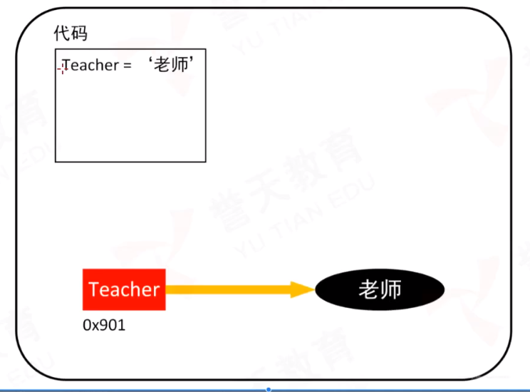
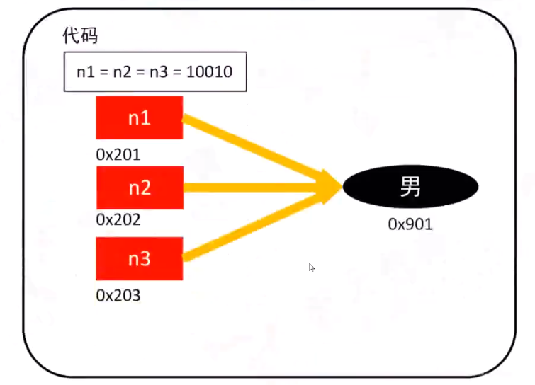
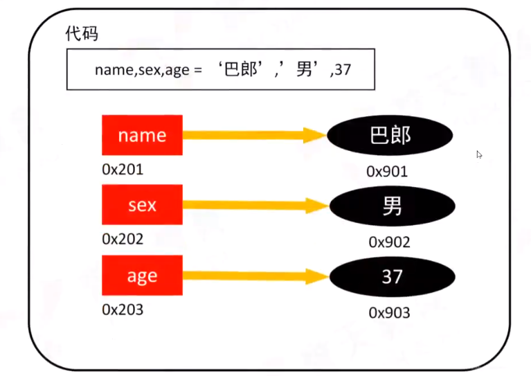
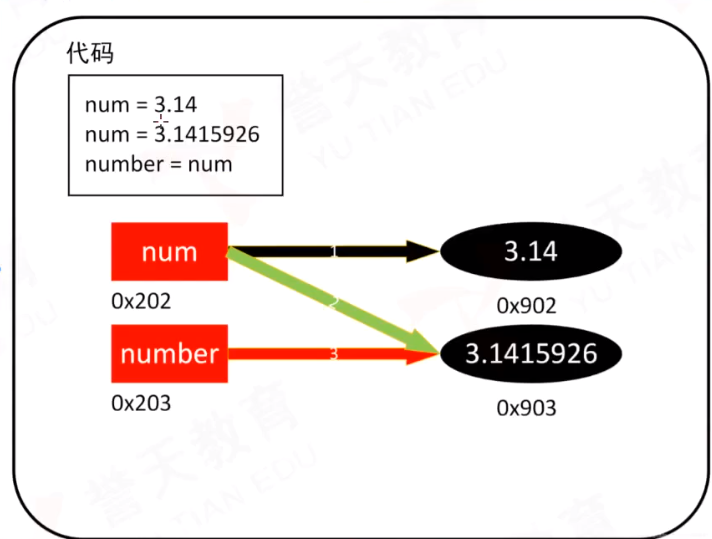

[toc]


# 基础语法


## 什么是python


面向对象的 解释型的计算机设计语言

对象：世间万物任何一个具备真实意识形态的物体 

以对象为中心 注重的是解决问题的方法 

面向对象：指代的是一种编程思想 以事件为中心注重解决问题的步骤 

解释型：程序在编写完了之后 没有预先编译的过程 拿到程序的源码可以直接运行 解释一行 运行一行 解释成机器码 

特点：如果程序出错则终止运行 

编译型：程序在编写完了之后 在正式运行之前要先统一预编译 编译成机器码 编译了之后再一次性运行 

特点：只要能运行 就不存在程序错误 

 

python解释器易于扩展 

Python3不完全兼容python2 

目前最新的稳定的版本是python3.9.5 


## python的特点：


优势：

语法简单易上手 高度语言化 

可扩展性高 面向其他的编程语言比较友好 

开发效率极高 第三方库组件丰富 生态完整

跨平台性非常好 

缺点：

太过高级 过近趋近应用层 解释和执行的效率较低 

python是一门胶水语言 

数据科学领域首选的语言 

依托数据的语言 


### 冯诺依曼体系： 


规定了计算机数值要采用二进制 计算机应该按照程序顺序运行 

规定了计算机硬件由以下五个部分组成

1. 输入数据和程序的输入设备
2. 记忆数据和程序的存储器 
3. 完成数据加工处理的运算器 
4. 控制程序执行的控制器
5. 输出处理结果的输出设备


### 操作系统承担的角色： 


1.  为用户提供一个GUI界面 - 图形界面，用户可以依靠相应的输入和输出设备来操作这个GUI，进而可以实现交互计算机 

2.  为应用程序和硬件之间的交互提供了一个媒介


机器能看懂的语言被称为机器码

高级编程语言写出来的代码被称为源代码


### python代码运行的步骤：


把py文件编译为pyc文件 然后通过解释器再进行解释

先编译成字节码 为了提升效率 实现跨平台

PEP-8 用于规范python编码风格 

缩进代表代码嵌套 逻辑层的包含和被包含的关系 

 

## PEP-8规范


缩进：四个空格为一个tab是一个标准

源文编码统一UTF-8 

模块或者包导入 单独一行 


### 注释规范

python只有单行注释 使用 # 注释


## python基本函数


### print()

#### 作用： 输出一定的内容

#### 语法：

```python 
print(data) # 需要输出的数据 
```


#### 同一个print输出多个内容

```python 
print(data1,date2,....) # 多条输出内容使用逗号间隔 
```


#### 常用参数：end

#### 作用： 指定结束符，如果没有指定 则是/n 用来换行 

```python 
print(data,data1,end=\n)
```


#### 常用参数sep

#### 作用：指定连接符

```python 
print(data1,data2,sep="连接，间隔符")
```


### input()

#### 作用： 接受键盘上输入的内容 

#### 语法：

```python 
data = input(输入提示) # 把键盘输入的内容赋予给data 
print(data)           #将从键盘中输入的data打印出来 
```


### del语句

#### 作用：

​	删除变量

#### 用法：

```python 
a = 1 
del a 
print(a) # 这个时候删除变量之后，变量a不存在，也不能被打印
```


## 变量：


### 什么是变量：

变量是一种方便的占位符，用于引用计算机的内存地址，该地址可以存储数据对象

通俗地讲，就是在内存中开辟一部分空间，并给他起个名字 

 

```python
变量 = 数据对象                   #申明一个变量存储一个对象

变量1 = 变量2 = 变量3 = ......    #申明多个变量 存储一个变量 

变量1, 变量2, 变量3, 变量4, .... = 数据对象1,数据对象2,.... #同时申明多个变量 存储多个对象 

a,b,c,d,e = 1,2,3,4,5 
print(a,b,c,d,e) 
```


### 声明变量的过程：



当python解释器解释tercher = “老师”的时候，

1.  第一步，解释器先向计算机内存中申请一块存储空间，该存储空间的地址为0x901
2.  第二步，为该存储空间命名 
3.  第三步，讲读取到内存的对象“老师”和该存储空间之间创建引用关系，该引用关系为变量引用对象，所以箭头指向为teacher===>”老师“ 


### 变量命名规则：

1.  变量命令不能用数字开头 

2.  变量的命名遵守驼峰命名法和匈牙利命名法 

3.  大驼峰：每个单词的首字母都用大写 

4.  小驼峰：所有单词中只有第二个单词大写 

5.  独立对象命名用大驼峰 

6.  有从属对象的情况用小驼峰命名

7.  匈牙利命名：根据引用对象的含义进行命名 看见变量要能理解意思 


多变量赋值和变量交换： 

重复引用同名变量 变量会重新赋值 以最后一次引用为标准 

 

### 总结：

1.  变量的声明赋值本质上是在创建比那辆和对象之间的引用关系 
2.  ”=“表示为赋值，创建引用，且一定是变量引用对象，不能反过来 ，所以是先声明变量，然后再赋值 
3.  python中=代表创建对象和变量之间的引用关系，而== 代表相等关系 
4.  单个变量只能引用一个对象 

 

### 拓展：

#### 多变量赋值和变量交换：



#### 多变量多赋值



#### 同一个变量名引用多个变量值



number进行引用的时候是拷贝引用关系 

后声明的变量 只有最后一个会生效 叫做引用变量的重新赋值 

3.14会被清理掉，被python的内部的监控给清理掉了 ，一个变量要是没有被引用，则被回收 


